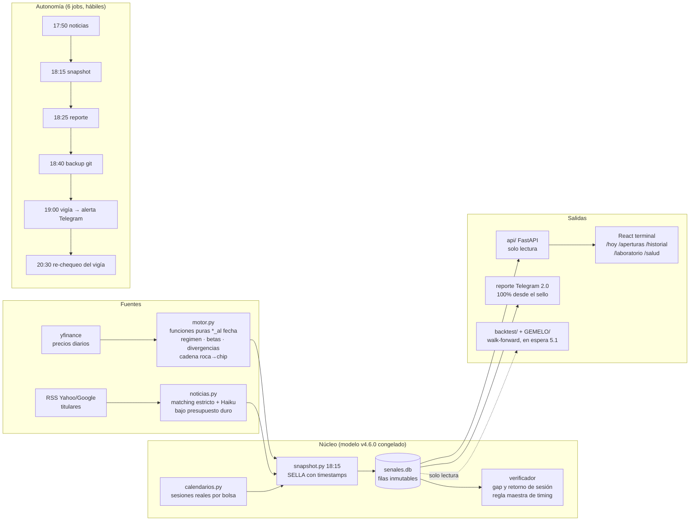

# MKI Terminal

> **TL;DR (English).** A self-running research terminal for the full
> semiconductor value chain (rock → chip → data center). Every night it
> **seals** timestamped predictions for the next Asian/European market
> opens — provably emitted *before* the sessions they anticipate — then
> verifies them against reality and publishes its own track record.
>
> **The central measurement is a step across exchanges, not a score, and not
> (yet) a mechanism.** Reconstructed over
> eight years (n=14.618), the model beats the "always up" baseline by
> **+19.1 pp in Tokyo, +16.8 in Taipei and +15.4 in Seoul** — the three
> exchanges that open **within three hours** of the emission — and by
> **+2.5 pp with p = 0.111 in Frankfurt**, which opens **8.75 hours**
> later. The obvious reading, an information cascade fading with elapsed
> time, was **pre-registered as a prediction for three new exchanges and
> failed** in two (Hong Kong: predicted +14.0 pp, measured +4.1; India:
> predicted +8.6, measured -12.7); the best predictor of the per-exchange
> edge is the base rate of positive gaps (r = -0.89), not hours elapsed.
> **The hand-off to Asia was refuted too.** The step is measured; the
> mechanism is a PROPOSAL. On the point-in-time sealed window (n=238) the edge is
> **+9.7 pp, day-cluster 95% CI [-7.2, +26.6]: still not distinguishable
> from zero** (nominal 95%, measured coverage ~0.93; cluster-t [-8.1, +27.4]) (row-level McNemar p = 0.0455, but the eight rows of a day
> share one SOX move: the day is the unit, and with it the interval
> contains zero). Until 2-sep it read n=248, +6.5 pp, p = 0.1849 under a
> convention since repealed (errata, D1).
>
> Both windows are published, with what each one can and cannot prove.
> Four workstreams of adversarial auditing sit underneath, including one
> that **refuted the project's own explanation** of the Frankfurt result
> and two that **corrected the project's own published numbers**.
> **No real money is traded.** Not financial advice.


---

## Lo medido: un escalón entre bolsas, no una ley de la distancia

Cuando Nueva York cierra, el SOX (índice de semiconductores) ya dijo lo
suyo — pero Seúl, Tokio, Taipéi y Fráncfort **todavía no abren**. La tesis
del sistema era que parte de ese movimiento se propaga a las aperturas del
día siguiente. Ocho años de datos reconstruidos dicen algo más preciso:
**se propaga, y se apaga.**

| Bolsa | n | Modelo | Base | Ventaja | McNemar p | Margen emisión→apertura |
|---|---|---|---|---|---|---|
| **Tokio** (XTKS) | 7.230 | 72.9% | 53.8% | **+19.1 pp** | ≈0 | **1.75 h** |
| **Taipéi** (XTAI) | 1.807 | 72.0% | 55.2% | **+16.8 pp** | ≈0 | **2.75 h** |
| **Seúl** (XKRX) | 3.626 | 71.2% | 55.8% | **+15.4 pp** | ≈0 | **1.75 h** |
| **Fráncfort** (XETR) | 1.955 | 57.2% | 54.7% | **+2.5 pp** | **0.111** | **8.75 h** |

Las tres bolsas que abren **dentro de tres horas** dan entre +15 y +19 pp.
La que abre casi **nueve horas** después **no es distinguible de cero**.

**Lo que ese escalón no es: una ley de la distancia.** La lectura de
mecanismo —una propagación de información que se apaga con las horas— se
pre-registró como predicción para tres bolsas nuevas antes de descargarlas
y falló en dos: Hong Kong (predicho +14,0 pp, medido +4,1) e India
(predicho +8,6, medido −12,7). Lo que mejor predice la ventaja por bolsa no
es el margen horario sino la tasa base de gaps positivos (r = −0,89).
Estatus: **CONTESTADA** (`decaimiento_prediccion.json`, dictamen B de la
octava corrida; `estado_epistemico.md` 14b). El escalón queda MEDIDO; el
mecanismo queda PROPUESTA.

Con **n = 4 bolsas no se puede ajustar una curva**. Esto es un **escalón
medido**, no un gradiente estimado: cuatro puntos, tres arriba y uno
abajo, con sus márgenes horarios verificados contra los calendarios
históricos reales de cada bolsa (0 violaciones en 15.033 pares; margen
mínimo 1.75 h, estable los nueve años).

Los márgenes salen de la auditoría adversarial del WS4
([`auditoria_ws3.md`](GEMELO/resultados/auditoria_ws3.md)); la ventana y
los aciertos, del WS3 ([`ventana_larga.md`](GEMELO/resultados/ventana_larga.md))
corregidos a la convención congelada en la §2.8.

## Y la explicación que probamos, y falló

La lectura obvia del cuadro anterior era que Fráncfort es débil **porque
Asia toma el relevo**: la cadena real sería NY → Asia → Europa, con Asia
como estación intermedia. Se pre-registró como hipótesis —**post-hoc y
declarada como tal**, porque nació de mirar ese mismo cuadro— con su N,
sus tres configuraciones y su regla de decisión **escritas antes de correr
nada** ([`preregistro_ws5.md`](GEMELO/resultados/preregistro_ws5.md)).

**REFUTADA.**

El insumo que la hipótesis necesita **no existe cuando el sistema emite**.
La sesión asiática que ocurre entre el cierre del SOX y la apertura de
Fráncfort cierra media hora antes de que Fráncfort abra — pero **8.25 h
después** de las 22:15 UTC en que el sistema sella. Y el cierre asiático
que **sí** es conocible cerró **antes** que el SOX del mismo día: es más
viejo (15.75 h contra 1.25 h) y redundante con lo que el modelo ya usa.

Medido sobre el holdout en cuarentena (n = 393 filas en Fráncfort, 2.548 en Asia):

| | E1 (solo SOX) | E2 (solo Asia) | Tasa base |
|---|---|---|---|
| **Asia** | **72.5%** | 55.3% | 56.6% |
| **Fráncfort** | **58.6%** | 53.4% | 55.1% |

**El SOX pierde 13.9 pp de acierto al alejarse. Asia se queda plana en la
tasa base en las dos.** E2 no mejora a E1 en ninguna parte: es peor en las
dos (−5.6 pp con p = 0.1296 en Fráncfort, −17.5 pp con p ≈ 0 en Asia).

**El contagio no se transfiere: se disipa.** La debilidad de Fráncfort no
se explica porque otro mercado tomara el relevo — se explica porque el SOX
se degrada con la distancia temporal y **nada lo reemplaza**.

Reporte completo, con la trampa de circularidad que este experimento tuvo
que esquivar (Samsung está *dentro* del KOSPI) y las tentaciones que
declaró y no tomó:
[`relevo_asiatico.md`](GEMELO/resultados/relevo_asiatico.md).

## Las dos ventanas, las dos

Ninguna reemplaza a la otra: **la sellada da validez, la larga da
potencia.**

### Sellada — la única evidencia point-in-time

Emitida **antes** del hecho, con timestamps UTC en SQLite y filas que
jamás se reescriben. Al **28-ago-2026** (instante pinchado
`cifras.CORTE_README`; se recomputa desde `senales.db` con `cifras.sellada()`),
sobre la **cadena canónica** (compuesta el 30-ago bajo la regla de
`docs/SOMBRA.md`: hasta el 25-ago manda el Mac, desde el 26-ago el PC),
bajo la convención congelada en la §2.8 (`excluir_cero`) y bajo la **regla
de deduplicación firmada el 1-sep-2026** (entre dos filas que apuntan a la
misma sesión objetivo sobrevive la que corresponde a su `available_at`,
nunca la más fresca; decisión D1, acta §78):

| | Acierto de gap | IC95 Wilson (filas) |
|---|---|---|
| **Modelo 4.6.0** | **67.6%** (161/238) | [61.5 – 73.3] |
| **"Siempre al alza", mismas filas** | **58.0%** (138/238) | [51.6 – 64.1] |
| **Ventaja** | **+9.7 pp** | IC95 de día **[-7.2, +26.6]** · McNemar p = 0.0455 (χ² con corrección de continuidad; binomial exacta 0.0451); percentil de día con cobertura medida ~0.93 (`calibracion_instrumento.md` A1), t de clúster [-8.1, +27.4] |

**Todavía NO distinguible de cero.** El McNemar de filas cruza el 5%, pero
las ocho filas de un día comparten el mismo movimiento del SOX: la unidad
es el día (34 días, ICC 0.39, DEFF 3.55, ~67 observaciones efectivas), y
con esa unidad el intervalo contiene el cero y la permutación de signo por
día da p = 0.29. El McNemar de filas se publica al lado porque es el test
del diseño original, no porque decida (acta §61).

**Y que se vea que se mueve, y por qué.** El 25-ago, con n=223, era
**+4.0 pp con p = 0.4633**. Hasta el 2-sep esta sección publicaba, en este
mismo corte, la rama sin deduplicar: era n=248, +6.5 pp, p = 0.1849.
**Errata 3-sep-2026:** esa convención quedó derogada por decisión de
Nicolás (D1). Las 10 filas que la regla retira son el lado viejo de 10
pares que apuntaban a una sesión que su insumo no podía predecir; de las
10, 7 eran discordantes y las 7 favorecían a la base. El salto de +6.5 a
+9.7 pp es la regla, no filas nuevas, y se publica con su causa.

| Otras métricas (n=238) | Valor | Caveat honesto |
|---|---|---|
| Acierto del retorno de sesión | 62.1% · IC95 [55.9–68.0] (n=243) | un solo régimen observado |
| **MAE del gap** | **2.52 pp** vs **2.98** de predecir cero | ganancia +0.45 pp por fila, IC95 t de clúster de día [-0.09, +1.00], p de día 0.10: **contiene el cero, no distinguible al nivel de día**; parte de la mejora respecto de la rama retirada es que la regla saca filas con gaps enormes del 29-jul |
| Cobertura del intervalo 80% | 92.9% (nominal 80%) | intervalos **2.19× más anchos** de lo necesario (IC95 de día [1.71, 2.78]) |
| Régimen | 1 sola etiqueta en 37 de 39 snapshots (2 sin etiqueta) | la columna no tiene varianza |

Todo esto se recomputa con `python -m backtest.linea_base`, que lee
`senales.db` en modo solo lectura.

### Larga — reconstruida, 59× la muestra

**n = 14.618 · +15.66 pp · McNemar p ≈ 0**, sobre ocho años y cuatro
bolsas, con el modelo de producción reconstruido (misma función, misma
ventana rodante de 120 sesiones; solo se amplía el rango de fechas). Sin IC
de clúster de día computado; reconstrucción sobre el caché v1, que omite
toda sesión posterior a un feriado local (~4,5 % de las filas): recomputar
mueve los doce bloques y lleva firma (`cifras.larga().procedencia`).

**Un matiz que corrige al propio proyecto.** El WS3 declaró como
limitación una *"contaminación por revisión"* del 91.4%: el 8.6% de las
filas reconstruidas no coincidiría con las selladas porque Yahoo reescribe
su historia. **Es falsa.** La auditoría del WS4 la desmontó: las 17 filas
"revisadas" estaban emparejadas con **otra sesión objetivo** (un sello
tardío del 29-jul salta una sesión completa). Alineando bien, la
desviación es **0.00% en las 223 filas**, y hay una razón estructural: el
factor de ajuste de Yahoo escala el *open* y el *close* previo **por
igual**, así que la razón se conserva. **La ventana larga es más válida de
lo que su propio autor creyó.**

**Lo que sí la limita** es otra cosa, y no se resuelve: es una
**reconstrucción con el código, el universo y los parámetros de hoy
aplicados hacia atrás**. El sesgo de supervivencia se acotó en dos
canales:

- **Entrada tardía: exactamente CERO.** Los ocho tickers objetivo tienen
  historia completa en toda la ventana. El único que empieza tarde es ARM
  (su OPV de 2023) y **no es objetivo**, así que la comparación restringida
  a historia completa es **idéntica** a la completa.
- **Salida: menos de 0.2 pp** incluso suponiendo que el **30%** del
  universo hubieran sido salidas (cota por regresión, plana tras quitar el
  confusor de bolsa: b = +0.60, R² = 0.051, n = 7).

**Y un tercer canal queda declarado NO EVALUABLE:** *una empresa en
dificultades se desacopla del sector, y ése es justamente el régimen donde
el contagio fallaría.* La regresión no puede capturar ese mecanismo, y sin
una lista histórica de constituyentes de la cadena no hay forma de
reconstruir el universo real de 2018. No está acotado — está **declarado**.

## Lo que la información expandida aporta

Aquí el proyecto se revisó a sí mismo, y el README no puede quedarse con
la versión vieja.

| | Muestra | C2 vs C1 (información expandida) |
|---|---|---|
| **WS2b** | 223 filas selladas | +2.8 pp, **p = 0.3613** · ΔMAE C2 vs C1 recomputado por clúster de día: +0.20 pp [-0.06, +0.43] sobre 79 filas parciales (`corrida09/ic_dmae_recomputados.md`), **incluye cero** |
| **WS3** | 12.628 filas | +1.3 pp, p = 0.0003 **de filas, sin IC de clúster de día**; la columna «IC del ΔMAE» estaba en escala de Sharpe, no en pp (errata 3-sep al pie de `ventana_larga.md`); recomputarla es NO EVALUABLE sin red |

El efecto encogió de +2.8 a +1.3 pp al pasar de 223 a 12.628 filas y el p
de filas bajó a 0.0003. Ese p trata las filas como independientes; con la
unidad de día (acta §61) el WS3 no está recomputado.

**Estatus: PROPUESTA. En la ventana sellada, el juez lineal bajo D3
(EXPLORATORIO, 3-sep) da C2 − C1 +0.20 pp [-0.09, +0.49], p de día 0.17:
los 16 features no traen magnitud detectable distinta de SOX(t, t−1).**
*"No significativo"* no es *"no hay nada"*; tampoco es *"sí aporta"*.

C1 existe precisamente para que esa lectura sea posible: usa **el mismo
insumo que el campeón con la maquinaria nueva**, de modo que *C2 vs C1*
separa "la información nueva sirve" de "la maquinaria nueva es mejor".
En la ventana sellada, C1 y el campeón aciertan la dirección en las
**mismas 215 filas** (McNemar 0 vs 0): la predicción es βᵢ·SOX con βᵢ>0,
así que su signo *es* el signo del SOX. **La regresión de betas aporta a
la magnitud, no a la dirección.**

## La corrección que la auditoría le hizo al propio proyecto

El WS3 publicó **+15.90 pp**. Puntuaba al modelo con `>=` y a la baseline
con `>`: las filas con `gap == 0.00` exacto se le **regalaban al campeón y
se le negaban a la baseline**. Es la misma asimetría del empate que la
§2.8 había **congelado** meses antes — y que el WS3 no aplicó.

**Magnitud: 105 filas de 15.033 (0.70%). Bajo la convención congelada la
ventaja es +15.66 pp.**

Infló 0.24 pp por no seguir su propia regla, y **una auditoría adversarial
encargada de derrumbar el hallazgo fue la que lo cazó**. En la misma
pasada cayó una segunda afirmación del WS3 —la del 91.4%— y una hipótesis
propia sobre un sello del 29-jul, refutada con un criterio **declarado por
escrito antes de correrlo**, con el sesgo nombrado y el umbral fijado
antes de mirar
([`criterio_rancio_declarado.md`](GEMELO/resultados/criterio_rancio_declarado.md)).

Tres amenazas más resultaron inofensivas, **con el número que lo
demuestra**: precios ajustados (desviación máxima 0.00% en 223 filas),
calendarios a ocho años (0 violaciones en 15.033 pares) y cambios de
instrumento (3 splits, ninguno coincide con un gap extremo).

## Integridad de medición (la pieza central)

Lo que diferencia este proyecto no es la señal — es la **honestidad del
experimento** alrededor de ella:

- **Regla maestra anti look-ahead:** una predicción solo es verificable si
  fue emitida ANTES de la apertura de la sesión que anticipa, demostrable
  con timestamps UTC sellados en SQLite (`timestamp_utc`, `available_at`,
  `sesion_objetivo` con calendarios reales de cada bolsa). Las emitidas
  tarde quedan como `no_verificable_timing`: auditables, fuera de TODAS
  las métricas. Un test de no-contaminación prueba que truncar los datos
  futuros no cambia ningún resultado del motor.
- **Las filas selladas jamás se reescriben.** Cuando la auditoría de
  julio-2026 encontró sellos degradados por descargas parciales, el
  resultado fue una **errata documentada** en DECISIONES.md — no una
  corrección retroactiva — y tres mitigaciones: salud de descarga sellada
  por snapshot, reintento parcial antes de sellar, y un vigía nocturno que
  alerta por Telegram lo que falte.
- **Pre-registro que no se edita para que cuadre.** Los criterios de
  victoria de la etapa 6.0.0 se congelaron **antes** de construir nada
  ([`GEMELO/DISEÑO.md`](GEMELO/DISEÑO.md)). Cuando el harness contradijo
  una cifra del documento, **mandó el harness** y la corrección se publicó
  aparte, con fecha posterior.
- **El N del DSR se declara antes de cada corrida y solo sube.** Va en 352
  (`backtest/veredicto_51.py: N_INTENTOS_PREVIO`; 358 con los seis del 5.1):
  re-evaluar la misma configuración sobre otra ventana produce otro
  resultado publicable entre los cuales se puede elegir, y **elegir entre
  resultados es exactamente lo que el Deflated Sharpe deflacta**. Contar
  de menos lo inutiliza.
- **Incertidumbre de primera clase:** cada acierto se publica con su
  intervalo de Wilson 95%, la cobertura del intervalo del 80% tiene su
  curva de calibración, y la advertencia va fija en la UI: *la muestra
  proviene de un solo régimen de mercado* — una sola etiqueta en 37 de 39
  snapshots (2 sin etiqueta), mientras la volatilidad realizada del SOX recorría un rango
  de 2×. La etiqueta no detecta la variación que sí existe.
- **El denominador al lado del número**, nunca en una nota al pie. Una
  tasa de acierto sin su tasa base no dice nada.
- **La palabra "confianza" está prohibida** en todo el sistema (hay un
  test que lo verifica): la incertidumbre se comunica con n, R² e
  intervalos — nunca con etiquetas subjetivas.

## Galería

| La cinta de husos y la portada | Aperturas selladas |
|---|---|
|  |  |

| Track record con calibración y Wilson | El laboratorio (backtest en espera) |
|---|---|
|  |  |

| La sala de máquinas |
|---|
|  |

## Arquitectura del flujo completo



## El laboratorio: seis baselines, veredicto pre-registrado

El motor de backtest walk-forward está **construido y probado** (test de
no-look-ahead del propio framework incluido: inyectar un dato futuro lo
hace reventar), con seis baselines que aíslan la contribución de cada capa
de información — B0 nulo · B1 momentum · **B2 = el modelo de producción
congelado** · B3 cuant de precio · B4 +noticias · B5 +cadena — un
**veredicto escalonado** (cada capa vs la anterior), benchmark obligatorio
de *comprar SMH y no hacer nada*, costos de 25 pb por lado, embargo de 5
días en la frontera train/test, y criterios congelados en
[`backtest/DISEÑO.md`](backtest/DISEÑO.md) ANTES del primer resultado.

**Nada de lo publicado arriba es ese veredicto**, y la distinción se
defiende con tests: los módulos de investigación no pueden invocarlo. Su
ejecución espera el gatillo (N ≥ 150 verificaciones en vivo y un cambio de
régimen, o 3 meses — lo primero) y es una **decisión humana**.

## Auditar cada cifra

Todo lo de este README es reproducible y está versionado:

| Documento | Qué contiene |
|---|---|
| [`GEMELO/DISEÑO.md`](GEMELO/DISEÑO.md) | El pre-registro congelado: criterios de victoria V1–V7 y barras de rechazo R1–R3 |
| [`control_lineal.md`](GEMELO/resultados/control_lineal.md) | WS2b — el control lineal sobre la ventana sellada (negativo) |
| [`ventana_larga.md`](GEMELO/resultados/ventana_larga.md) | WS3 — la misma comparación con ocho años de muestra |
| [`auditoria_ws3.md`](GEMELO/resultados/auditoria_ws3.md) | WS4 — la auditoría adversarial: siete amenazas, el desglose por bolsa, dos hallazgos del WS3 refutados |
| [`criterio_rancio_declarado.md`](GEMELO/resultados/criterio_rancio_declarado.md) | El criterio del 29-jul, declarado por escrito **antes** de correrlo |
| [`preregistro_ws5.md`](GEMELO/resultados/preregistro_ws5.md) | WS5 — N, configuraciones y regla de decisión, antes de correr nada |
| [`relevo_asiatico.md`](GEMELO/resultados/relevo_asiatico.md) | WS5 — la hipótesis del relevo asiático, refutada |
| [DECISIONES.md](DECISIONES.md) | Cada decisión autónoma del proyecto con su porqué, incluidas las erratas |

`python -m backtest.linea_base` recalcula toda la ventana sellada desde
`senales.db` en modo solo lectura. **Una afirmación de integridad que no
se puede recomputar es una afirmación de marketing.**

## Roadmap

1. **Etapa 6.0.0 — el retador:** el control lineal corrió sobre las dos
   ventanas y la auditoría adversarial lleva nueve corridas. Quedan por
   construir los niveles que el control lineal no cubre: β en espacio de
   estados, pooling jerárquico por nivel de la cadena, régimen latente y
   densidad predictiva con colas.
2. **Etapa 5.1 — el veredicto:** ejecutar el backtest escalonado cuando el
   track record madure. Solo si aprueba →
3. Datos intradía (fuente paga) → 4. Paper trading → 5. Autonomía graduada
   con guardarraíles. **Hoy el sistema NO opera dinero y no genera
   órdenes** — es un instrumento de medición.

## Stack

Python (pandas, yfinance, exchange-calendars, FastAPI) · SQLite con sellos
inmutables y CSVs versionados como respaldo · Claude Haiku para noticias
(con tope de gasto diario en `.env` y freno duro) · React + TypeScript +
Tailwind 4 + Recharts (terminal en :5173) · Streamlit como fallback ·
launchd/systemd (6 jobs, según plataforma) · pytest (652 tests: 650 passed, 2 xfailed al
6-sep-2026) +
Playwright. **Sin scipy ni sklearn**: la maquinaria de inferencia (PSR,
Deflated Sharpe, error estándar de Lo, bootstrap circular de bloques) está
escrita en `backtest/inferencia.py` sobre `math.erfc`, con 14 valores de
referencia exactos a 10 decimales.

## Cómo correrlo

```bash
python -m venv venv && source venv/bin/activate
pip install -r requirements.txt          # versiones fijadas
cp .env.example .env                     # completa tus claves (opcional)
./mki arrancar                           # API :8000 + terminal :5173
./mki instalar                           # los 6 jobs automáticos + hook
./mki estado                             # ¿está todo vivo?
```

Guía completa de desarrollo en [README-DEV.md](README-DEV.md); las
decisiones de diseño (todas, con su porqué) en
[DECISIONES.md](DECISIONES.md).

---

*Herramienta de análisis y aprendizaje — **no constituye asesoría
financiera**. Datos de Yahoo Finance con retraso; sin garantía de
exactitud.*
