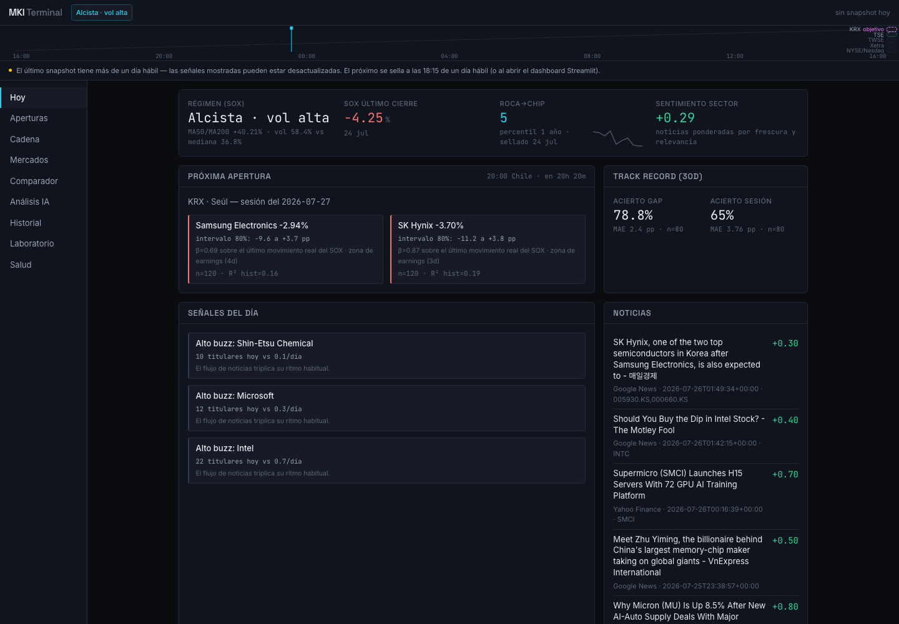
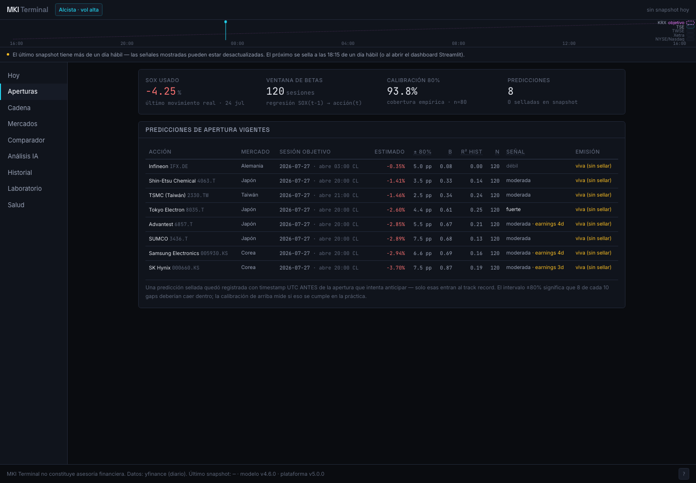
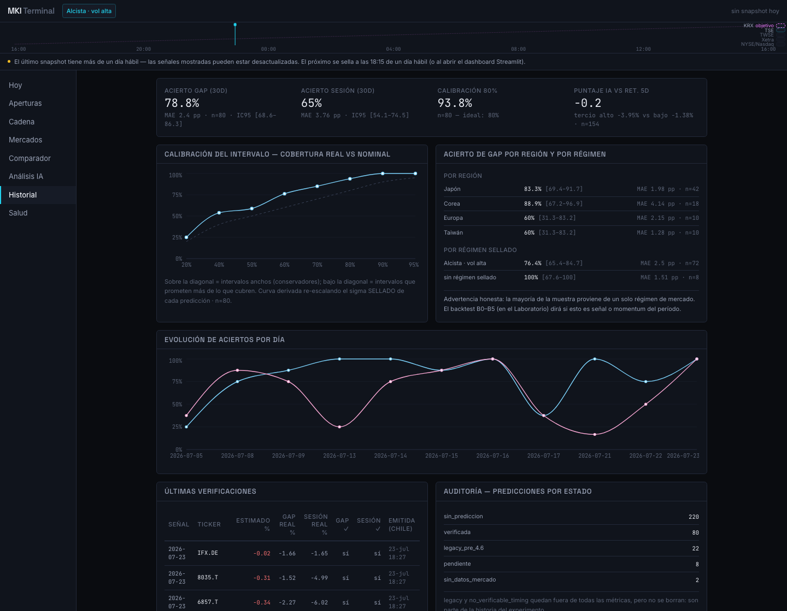
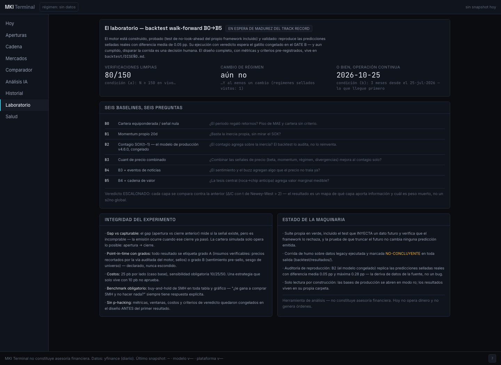
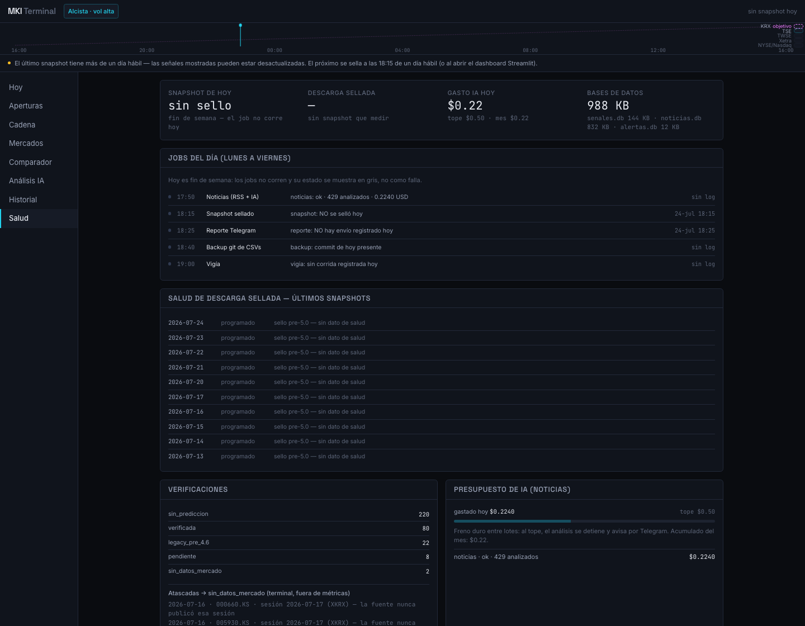
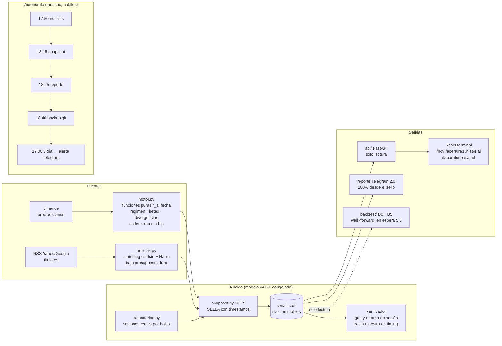

# MKI Terminal

> **TL;DR (English).** A self-running research terminal for the full
> semiconductor value chain (rock → chip → data center). Every night it
> **seals** timestamped predictions for the next Asian/European market
> opens — provably emitted *before* the sessions they anticipate — then
> verifies them against reality and publishes its own track record with
> Wilson intervals and calibration curves. A frozen v4.6.0 model, an
> autonomous 5-job pipeline with a hard AI-spend cap, a walk-forward
> backtest engine (B0→B5 baselines, pre-registered verdict criteria)
> waiting for the live track record to mature, and a React terminal to
> watch it all. **No real money is traded.** Not financial advice.




---

## La tesis: el contagio viaja con el sol

Cuando Nueva York cierra, el SOX (índice de semiconductores) ya dijo lo
suyo — pero Seúl, Tokio, Taipéi y Fráncfort **todavía no abren**. La tesis
del sistema es que parte de ese movimiento se propaga a las aperturas
asiáticas y europeas del día siguiente, y que la propagación es medible y
anticipable con horas de ventaja.

La evidencia que la sostiene (252 sesiones, calculada por el propio
sistema): Samsung Electronics correlaciona **0.92 con el KOSPI el mismo
día** — se mueve con su bolsa — pero solo **0.24 con el SOX del mismo
día**… y **0.38 con el SOX del día ANTERIOR**. La información americana
llega a Corea con un día de desfase: esa es la ventana que el anticipador
explota, con una beta de contagio por acción (regresión rodante de 120
sesiones) aplicada al último movimiento real del SOX.

## Integridad de medición (la pieza central)

Lo que diferencia este proyecto no es la señal — es la **honestidad del
experimento** alrededor de ella:

- **Regla maestra anti look-ahead:** una predicción solo es verificable si
  fue emitida ANTES de la apertura de la sesión que anticipa, demostrable
  con timestamps UTC sellados en SQLite (`timestamp_utc`, `available_at`,
  `sesion_objetivo` con calendarios reales de cada bolsa). Las emitidas
  tarde quedan como `no_verificable_timing`: auditables, fuera de TODAS
  las métricas. Un test de no-contaminación patched sobre el único punto
  de descarga del motor prueba que truncar los datos futuros no cambia
  ningún resultado.
- **Las filas selladas jamás se reescriben.** Cuando la auditoría de
  julio-2026 encontró sellos degradados por descargas parciales
  (DarkWake del Mac → Yahoo a medias), el resultado fue una **errata
  documentada** en DECISIONES.md — no una corrección retroactiva — y tres
  mitigaciones: salud de descarga sellada por snapshot, reintento parcial
  antes de sellar, y un vigía nocturno que alerta por Telegram lo que
  falte. Así se ve un experimento real: con sus huecos a la vista.
- **Incertidumbre de primera clase:** cada acierto se publica con su
  intervalo de Wilson 95% (78.8% de acierto de gap con n=80 se muestra
  como **78.8% [68.6–86.3]**), la cobertura del intervalo del 80% tiene
  su curva de calibración, y la advertencia va fija en la UI: *la muestra
  proviene casi entera de un solo régimen de mercado; el backtest B0–B5
  dirá si esto es señal o momentum*.
- **La palabra "confianza" está prohibida** en todo el sistema (hay un
  test que lo verifica): la incertidumbre se comunica con n, R² e
  intervalos — nunca con etiquetas subjetivas.

## Galería

| La cinta de husos y la portada | Aperturas selladas |
|---|---|
|  |  |

| Track record con calibración y Wilson | El laboratorio (backtest en espera) |
|---|---|
|  |  |

| La sala de máquinas |
|---|
|  |

## Arquitectura del flujo completo



## El track record vivo (al 25-jul-2026)

| Métrica | Valor | Caveat honesto |
|---|---|---|
| Acierto de dirección del gap | **78.8%** · IC95 [68.6–86.3] · n=80 | un solo régimen observado |
| Acierto del retorno de sesión | 65.0% · IC95 [54.1–74.5] | ídem |
| MAE del gap | 2.40 pp | — |
| Cobertura del intervalo 80% | 93.8% | intervalos anchos (conservadores) |

El desglose por región y régimen, con Wilson por celda, vive en
`/historial`. Estos números **no** demuestran valor económico: esa
pregunta es del backtest.

## El laboratorio: seis baselines, veredicto pre-registrado

El motor de backtest walk-forward está **construido y probado** (test de
no-look-ahead del propio framework incluido: inyectar un dato futuro lo
hace reventar), con seis baselines que aíslan la contribución de cada capa
de información — B0 nulo · B1 momentum · **B2 = el modelo de producción
congelado** · B3 cuant de precio · B4 +noticias · B5 +cadena — un
**veredicto escalonado** (cada capa vs la anterior, ΔIC con Newey-West),
benchmark obligatorio de *comprar SMH y no hacer nada*, costos de 25 pb
por lado con sensibilidad, y criterios congelados en
[`backtest/DISEÑO.md`](backtest/DISEÑO.md) ANTES del primer resultado.

Su ejecución con veredicto espera el gatillo (N ≥ 150 verificaciones en
vivo y un cambio de régimen, o 3 meses de operación — lo primero) y es una
decisión humana. La corrida de humo está publicada en
`backtest/resultados/` marcada NO-CONCLUYENTE — e igual enseñó: B2
reproduce las 50 predicciones selladas reales con 0.05 pp de diferencia
media, y ninguna cartera capturable sobrevivió a los costos en la ventana
de prueba. Se publica igual. Así funciona esto.

## Roadmap

1. **Etapa 5.1 — el veredicto:** ejecutar el backtest cuando el track
   record madure. Solo si aprueba →
2. Datos intradía (fuente paga) → 3. Paper trading → 4. Autonomía graduada
   con guardarraíles. **Hoy el sistema NO opera dinero y no genera
   órdenes** — es un instrumento de medición.

## Stack

Python (pandas, yfinance, exchange-calendars, FastAPI) · SQLite con sellos
inmutables y CSVs versionados como respaldo · Claude Haiku para noticias
(con tope de gasto diario en `.env` y freno duro) · React + TypeScript +
Tailwind 4 + Recharts (terminal en :5173) · Streamlit como fallback ·
launchd (5 jobs) · pytest (49 tests) + Playwright.

## Cómo correrlo

```bash
python -m venv venv && source venv/bin/activate
pip install -r requirements.txt          # versiones fijadas
cp .env.example .env                     # completa tus claves (opcional)
./mki arrancar                           # API :8000 + terminal :5173
./mki instalar                           # los 5 jobs de launchd + hook
./mki estado                             # ¿está todo vivo?
```

Guía completa de desarrollo en [README-DEV.md](README-DEV.md); las
decisiones de diseño (todas, con su porqué) en
[DECISIONES.md](DECISIONES.md).

---

*Herramienta de análisis y aprendizaje — **no constituye asesoría
financiera**. Datos de Yahoo Finance con retraso; sin garantía de
exactitud.*
