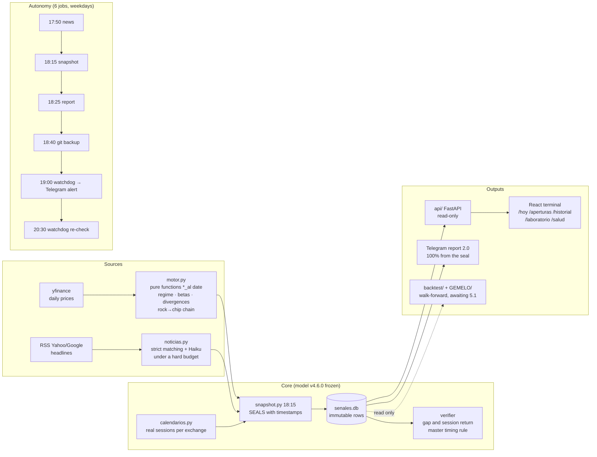

[Versión en español](README.es.md)

# MKI Terminal

**A measurement instrument for a market hypothesis. Its own errors get caught, dated and published.**

> **TL;DR (English).** A self-running research terminal for the full
> semiconductor value chain (rock → chip → data center). Every night it
> **seals** timestamped predictions for the next Asian/European market
> opens — provably emitted *before* the sessions they anticipate — then
> verifies them against reality and publishes its own track record.
>
> **The central measurement is a step across exchanges, not a score, and not
> (yet) a mechanism.** Reconstructed over
> eight years (n={{larga_n}}), the model beats the "always up" baseline by
> **{{larga_tokio_ventaja_pp}} pp in Tokyo, {{larga_taipei_ventaja_pp}} in Taipei and {{larga_seul_ventaja_pp}} in Seoul** — the three
> exchanges that open **within three hours** of the emission — and by
> **{{larga_francfort_ventaja_pp}} pp with p = {{larga_p_francfort}} in Frankfurt**, which opens **{{larga_francfort_margen_h}} hours**
> later. The obvious reading, an information cascade fading with elapsed
> time, was **pre-registered as a prediction for three new exchanges and
> failed** in two (Hong Kong: predicted +14.0 pp, measured +4.1; India:
> predicted +8.6, measured -12.7); the best predictor of the per-exchange
> advantage is the base rate of positive gaps (r = -0.89), not hours elapsed.
> **The hand-off to Asia was refuted too.** The step is measured; the
> mechanism is a PROPOSAL. On the point-in-time sealed window (n={{n}}) the advantage is
> **{{ventaja_pp}} pp, day-cluster 95% CI {{ventaja_ic_dia}}: still not distinguishable
> from zero** (nominal 95%, measured coverage ~0.93; cluster-t {{ventaja_ic_t_cluster}}) (row-level McNemar p = {{mcnemar_p}}, χ² with Edwards continuity correction; exact binomial {{mcnemar_p_exacta}}, but the eight rows of a day
> share one SOX move: the day is the unit, and with it the interval
> contains zero). Until 2-sep it read n=248, +6.5 pp, p = 0.1849 under a
> convention since repealed (errata, D1).
>
> Both windows are published, with what each one can and cannot prove.
> Four workstreams of adversarial auditing sit underneath, including one
> that **refuted the project's own explanation** of the Frankfurt result
> and two that **corrected the project's own published numbers**.
> **No real money is traded.** Not financial advice.


---

## What was measured: a step across exchanges, not a law of distance

When New York closes, the SOX (semiconductor index) has already had its
say — but Seoul, Tokyo, Taipei and Frankfurt **have not opened yet**. The
system's thesis was that part of that move propagates to the next day's
opens. Eight years of reconstructed data say something more precise:
**it propagates, and it fades.**

| Exchange | n | Model | Baseline | Advantage | McNemar p | Emission→open margin |
|---|---|---|---|---|---|---|
| **Tokyo** (XTKS) | {{larga_tokio_n}} | 72.9% | 53.8% | **{{larga_tokio_ventaja_pp}} pp** | ≈0 | **{{larga_tokio_margen_h}} h** |
| **Taipei** (XTAI) | {{larga_taipei_n}} | 72.0% | 55.2% | **{{larga_taipei_ventaja_pp}} pp** | ≈0 | **{{larga_taipei_margen_h}} h** |
| **Seoul** (XKRX) | {{larga_seul_n}} | 71.2% | 55.8% | **{{larga_seul_ventaja_pp}} pp** | ≈0 | **{{larga_seul_margen_h}} h** |
| **Frankfurt** (XETR) | {{larga_francfort_n}} | 57.2% | 54.7% | **{{larga_francfort_ventaja_pp}} pp** | **{{larga_p_francfort}}** | **{{larga_francfort_margen_h}} h** |

The three exchanges that open **within three hours** give between +15 and
+19 pp. The one that opens almost **nine hours** later **is not
distinguishable from zero**.

**What that step is not: a law of distance.** The mechanism reading — an
information propagation that fades with the hours — was pre-registered as
a prediction for three new exchanges before downloading them, and failed
in two: Hong Kong (predicted +14.0 pp, measured +4.1) and India
(predicted +8.6, measured −12.7). What best predicts the per-exchange
advantage is not the time margin but the base rate of positive gaps
(r = −0.89). Status: **TESTED AND FAILED** (`decaimiento_prediccion.json`,
ruling B of the eighth run; `estado_epistemico.md` 14b). The step stands
as MEASURED; the mechanism stands as PROPOSAL.

With **n = 4 exchanges no curve can be fitted**. This is a **measured
step**, not an estimated gradient: four points, three up and one down,
with their time margins verified against the real historical calendars of
each exchange (0 violations in 15.033 pairs; minimum margin 1.75 h, stable
across the nine years).

The margins come from the WS4 adversarial audit
([`auditoria_ws3.md`](GEMELO/resultados/auditoria_ws3.md)); the window and
the hit rates, from WS3 ([`ventana_larga.md`](GEMELO/resultados/ventana_larga.md)),
corrected to the convention frozen in §2.8.

## And the explanation we tested, which failed

The obvious reading of the table above was that Frankfurt is weak
**because Asia takes over**: the real chain would be NY → Asia → Europe,
with Asia as the intermediate station. It was pre-registered as a
hypothesis — **post-hoc and declared as such**, because it was born from
looking at that very table — with its N, its three configurations and its
decision rule **written before running anything**
([`preregistro_ws5.md`](GEMELO/resultados/preregistro_ws5.md)).

**REFUTED.**

The input the hypothesis needs **does not exist when the system emits**.
The Asian session that takes place between the SOX close and the
Frankfurt open closes half an hour before Frankfurt opens — but **8.25 h
after** the 22:15 UTC at which the system seals. And the Asian close that
**is** knowable closed **before** the same day's SOX: it is older (15.75 h
versus 1.25 h) and redundant with what the model already uses.

Measured on the quarantined holdout (n = 393 rows in Frankfurt, 2.548 in Asia):

| | E1 (SOX only) | E2 (Asia only) | Base rate |
|---|---|---|---|
| **Asia** | **72.5%** | 55.3% | 56.6% |
| **Frankfurt** | **58.6%** | 53.4% | 55.1% |

**The SOX loses 13.9 pp of hit rate as it moves away. Asia stays flat at
the base rate in both.** E2 does not improve on E1 anywhere: it is worse
in both (−5.6 pp with p = 0.1296 in Frankfurt, −17.5 pp with p ≈ 0 in Asia).

**The contagion is not handed over: it dissipates.** Frankfurt's weakness
is not explained by another market taking over — it is explained by the
SOX degrading with temporal distance and **nothing replacing it**.

Full report, with the circularity trap this experiment had to sidestep
(Samsung is *inside* the KOSPI) and the temptations it declared and did
not take:
[`relevo_asiatico.md`](GEMELO/resultados/relevo_asiatico.md).

## The two windows, both of them

Neither replaces the other: **the sealed one gives validity, the long one
gives power.**

### Sealed — the only point-in-time evidence

Emitted **before** the fact, with UTC timestamps in SQLite and rows that
are never rewritten. As of **28-Aug-2026** (pinned instant
`cifras.CORTE_README`; recomputed from `senales.db` with `cifras.sellada()`),
over the **canonical chain** (composed on 30-Aug under the rule in
`docs/SOMBRA.md`: up to 25-Aug the Mac rules, from 26-Aug the PC),
under the convention frozen in §2.8 (`excluir_cero`) and under the
**deduplication rule signed on 1-Sep-2026** (between two rows pointing at
the same target session, the one matching its `available_at` survives,
never the freshest; decision D1, minutes §78):

| | Gap hit rate | Wilson 95% CI (rows) |
|---|---|---|
| **Model 4.6.0** | **{{modelo_pct}}%** ({{modelo_aciertos}}/{{n}}) | {{modelo_wilson}} |
| **"Always up", same rows** | **{{base_pct}}%** ({{base_aciertos}}/{{n}}) | {{base_wilson}} |
| **Advantage** | **{{ventaja_pp}} pp** | day-cluster 95% CI **{{ventaja_ic_dia}}** · McNemar p = {{mcnemar_p}} (χ² with continuity correction; exact binomial {{mcnemar_p_exacta}}); day percentile with measured coverage ~0.93 (`calibracion_instrumento.md` A1), cluster-t {{ventaja_ic_t_cluster}} |

**Still NOT distinguishable from zero.** The row-level McNemar crosses 5%,
but the eight rows of a day share the same SOX move: the unit is the day
({{dias}} days, ICC {{icc}}, DEFF {{deff}}, ~{{n_efectivo}} effective observations), and
with that unit the interval contains zero and the per-day sign permutation
gives p = {{p_permutacion_dia}}. The row-level McNemar is published alongside because
it is the test of the original design, not because it decides (minutes §61).

**TESTED AND FAILED: the advantage is not capturable.** Entering at the open
and exiting at the close loses 40.7% with zero costs and 95.6% at 25 bp per
side, against +137.1% for buying the sector ETF (minutes §59;
`estado_epistemico.md` §10). The gap exists; the session return does not follow it.

**And let it be seen that it moves, and why.** On 25-Aug, with n=223, it
was **+4.0 pp with p = 0.4633**. Until 2-Sep this section published, at
this same cut-off, the non-deduplicated branch: it was n=248, +6.5 pp,
p = 0.1849 — figures now in the errata. **Erratum 3-Sep-2026:** that
convention was repealed by Nicolás's decision (D1). The 10 rows the rule
removes are the old side of 10 pairs that pointed at a session their
input could not predict; of the 10, 7 were discordant and the 7 favoured
the baseline. The jump from +6.5 to +9.7 pp is the rule, not new rows,
and it is published with its cause.

| Other metrics (n={{n}}) | Value | Honest caveat |
|---|---|---|
| Session-return hit rate | {{retorno_pct}}% · 95% CI {{retorno_wilson}} (n={{retorno_n}}) | a single regime observed |
| **Gap MAE** | **{{mae_modelo_pp}} pp** vs **{{mae_cero_pp}}** for predicting zero | gain {{mae_ganancia_pp}} pp per row, day-cluster t 95% CI {{mae_ganancia_ic_t_dia}}, day p {{mae_ganancia_p_dia}}: **contains zero, not distinguishable at the day level**; part of the improvement over the withdrawn branch is that the rule removes rows with huge gaps from 29-Jul |
| 80% interval coverage | {{cobertura_80_pct}}% (nominal 80%) | intervals **{{ratio_ancho}}× wider** than needed (day-cluster 95% CI {{ratio_ancho_ic_dia}}) |
| Regime | 1 label only in 37 of 39 snapshots (2 unlabelled) | the column has no variance |

All of this is recomputed with `python -m backtest.linea_base`, which reads
`senales.db` in read-only mode.

### Long — reconstructed, 59× the sample

**n = {{larga_n}} · {{larga_ventaja_pp}} pp · McNemar p ≈ 0** (χ² with continuity correction, `GEMELO/control_lineal._mcnemar`; the exact binomial was not computed at this n), over eight years and four
exchanges, with the production model reconstructed (same function, same
rolling window of 120 sessions; only the date range is widened). No
day-cluster CI computed; reconstruction over the v1 cache, which omits
every session following a local holiday (~4.5% of the rows): recomputing
moves the twelve blocks and requires a signature (`cifras.larga().procedencia`).

**A nuance that corrects the project itself.** WS3 declared as a
limitation a *"revision contamination"* of 91.4% (now in the errata):
8.6% of the reconstructed rows would not match the sealed ones because
Yahoo rewrites its history. **It is false.** The WS4 audit dismantled it:
the 17 "revised" rows were paired with **another target session** (a late
seal of 29-Jul skips a whole session). Aligned properly, the deviation is
**0.00% across the 223 rows**, and there is a structural reason: Yahoo's
adjustment factor scales the *open* and the previous *close* **equally**,
so the ratio is preserved. **The long window is more valid than its own
author believed.**

**What does limit it** is something else, and it is not resolved: it is a
**reconstruction with today's code, universe and parameters applied
backwards**. Survivorship bias was bounded in two channels:

- **Late entry: exactly ZERO.** The eight target tickers have complete
  history across the whole window. The only one that starts late is ARM
  (its 2023 IPO) and **it is not a target**, so the comparison restricted
  to complete history is **identical** to the full one.
- **Exit: less than 0.2 pp** even assuming that **30%** of the universe
  had been exits (regression bound, flat after removing the exchange
  confounder: b = +0.60, R² = 0.051, n = 7).

**And a third channel is declared NOT ASSESSABLE:** *a company in
distress decouples from the sector, and that is precisely the regime where
the contagion would fail.* The regression cannot capture that mechanism,
and without a historical list of chain constituents there is no way to
reconstruct the real 2018 universe. It is not bounded — it is **declared**.

## What the expanded information contributes

Here the project reviewed itself, and the README cannot keep the old
version.

| | Sample | C2 vs C1 (expanded information) |
|---|---|---|
| **WS2b** | 223 sealed rows | +2.8 pp, **p = 0.3613** · ΔMAE C2 vs C1 recomputed by day cluster: +0.20 pp [-0.06, +0.43] over 79 partial rows (`corrida09/ic_dmae_recomputados.md`), **includes zero** |
| **WS3** | 12.628 rows | +1.3 pp, p = 0.0003 **row-level, with no day-cluster CI**; the "ΔMAE CI" column was in Sharpe scale, not in pp (erratum 3-Sep at the foot of `ventana_larga.md`); recomputing it is NOT ASSESSABLE without network access |

The effect shrank from +2.8 to +1.3 pp on going from 223 to 12.628 rows
and the row-level p fell to 0.0003. That p treats rows as independent;
with the day as the unit (minutes §61) WS3 has not been recomputed.

**Status: PROPOSAL. On the sealed window, the linear judge under D3
(EXPLORATORY, 3-Sep) gives C2 − C1 +0.20 pp [-0.09, +0.49], day p 0.17:
the 16 features bring no detectable magnitude distinct from SOX(t, t−1).**
*"Not significant"* is not *"there is nothing"*; nor is it *"it does
contribute"*.

C1 exists precisely so that this reading is possible: it uses **the same
input as the champion with the new machinery**, so that *C2 vs C1*
separates "the new information is useful" from "the new machinery is
better". On the sealed window, C1 and the champion get the direction right
on the **same 215 rows** (McNemar 0 vs 0): the prediction is βᵢ·SOX with
βᵢ>0, so its sign *is* the sign of the SOX. **The beta regression
contributes to magnitude, not to direction.**

## The correction the audit made to the project itself

WS3 published **+15.90 pp**. It scored the model with `>=` and the
baseline with `>`: rows with an exact `gap == 0.00` were **gifted to the
champion and denied to the baseline**. It is the same tie asymmetry that
§2.8 had **frozen** months earlier — and that WS3 did not apply.

**Magnitude: 105 rows out of 15.033 (0.70%). Under the frozen convention
the advantage is {{larga_ventaja_pp}} pp.**

It inflated 0.24 pp by not following its own rule, and **an adversarial
audit commissioned to tear down the finding was the one that caught it**.
In the same pass a second WS3 claim fell — the 91.4% one, now in the
errata — and a hypothesis of the project's own about a 29-Jul seal,
refuted with a criterion **declared in writing before running it**, with
the bias named and the threshold fixed before looking
([`criterio_rancio_declarado.md`](GEMELO/resultados/criterio_rancio_declarado.md)).

Three more threats turned out harmless, **with the number that proves
it**: adjusted prices (maximum deviation 0.00% across 223 rows),
eight-year calendars (0 violations in 15.033 pairs) and instrument changes
(3 splits, none coinciding with an extreme gap).

## Measurement integrity (the centrepiece)

What sets this project apart is not the signal — it is the **honesty of
the experiment** around it:

- **Master anti-look-ahead rule:** a prediction is only verifiable if it
  was emitted BEFORE the open of the session it anticipates, provably via
  UTC timestamps sealed in SQLite (`timestamp_utc`, `available_at`,
  `sesion_objetivo` with each exchange's real calendar). Late ones remain
  as `no_verificable_timing`: auditable, outside ALL metrics. A
  no-contamination test proves that truncating future data changes no
  result of the engine.
- **Sealed rows are never rewritten.** When the July-2026 audit found
  seals degraded by partial downloads, the outcome was a **documented
  erratum** in DECISIONES.md — not a retroactive correction — and three
  mitigations: download health sealed per snapshot, partial retry before
  sealing, and a nightly watchdog that reports via Telegram whatever is
  missing.
- **Pre-registration that is not edited to fit.** The victory criteria of
  stage 6.0.0 were frozen **before** building anything
  ([`GEMELO/DISEÑO.md`](GEMELO/DISEÑO.md)). When the harness contradicted
  a figure in the document, **the harness won** and the correction was
  published separately, with a later date.
- **The DSR's N is declared before every run and only goes up.** It stands
  at 352 (`backtest/veredicto_51.py: N_INTENTOS_PREVIO`; 358 with the six
  from 5.1): re-evaluating the same configuration on another window
  produces another publishable result to choose between, and **choosing
  between results is exactly what the Deflated Sharpe deflates**.
  Undercounting makes it useless.
- **First-class uncertainty:** every hit rate is published with its
  Wilson 95% interval, the coverage of the 80% interval has its
  calibration curve, and the warning is fixed in the UI: *the sample
  comes from a single market regime* — a single label in 37 of 39
  snapshots (2 unlabelled), while the SOX's realised volatility spanned a
  2× range. The label does not detect the variation that does exist.
- **The denominator beside the number**, never in a footnote. A hit rate
  without its base rate says nothing.
- **Subjective certainty labels are banned system-wide, this page
  included** (a test verifies it, which is why the word itself is not
  printed here): uncertainty is communicated with n, R² and intervals —
  never with subjective labels.

## Gallery

| The time-zone ribbon and the front page | Sealed opens |
|---|---|
|  |  |

| Track record with calibration and Wilson | The laboratory (backtest on hold) |
|---|---|
|  |  |

| The engine room |
|---|
|  |

## Architecture of the full pipeline



## The laboratory: six baselines, pre-registered verdict

The walk-forward backtest engine is **built and tested** (the framework's
own no-look-ahead test included: injecting a future datum makes it blow
up), with six baselines that isolate the contribution of each information
layer — B0 null · B1 momentum · **B2 = the frozen production model** ·
B3 price quant · B4 +news · B5 +chain — a **staggered verdict** (each
layer vs the previous one), a mandatory benchmark of *buy SMH and do
nothing*, costs of 25 bp per side, a 5-day embargo at the train/test
boundary, and criteria frozen in
[`backtest/DISEÑO.md`](backtest/DISEÑO.md) BEFORE the first result.

**Nothing published above is that verdict**, and the distinction is
defended with tests: the research modules cannot invoke it. Its execution
awaits the trigger (N ≥ 150 live verifications and a regime change, or
3 months — whichever first) and is a **human decision**.

## Execution rail (paper only)

- **E0 in progress** — every trading night the machine emits and seals a decision
  for the next NYSE open with nominal size zero, driven by a
  no-information random draw (labelled “machinery test, not a track
  record”). Sealed prospective sessions so far:
  **{{e0_sesiones_selladas}}**, of which **{{e0_cuentan_para_N}}** count
  towards N = {{e0_N_objetivo}}; the ones that do not ({{e0_no_cuentan}}) had
  incomplete or late input (last sealed input session: {{e0_ultima_fecha_insumo}}). The count is read from `data/backups/sello_dinero.csv`, the exported copy of the sealing database that the daily backup job versions (it moves one session per night), not typed by hand.
- **E1 not executed** — broker paper account. Exit condition: the machine
  sends an order and reads back its own execution through the official
  API in the same cycle. No practice account and no gateway exist yet;
  the adapter refuses in code to connect to anything that is not a paper
  account, and a test proves it.
- **E2 not started** — real capital, minimum size, only after E0 and E1
  and only against a pre-registered yardstick. No real money is traded.
  Not financial advice.

Nothing in this rail claims an advantage: the rail exists to test whether
the sealing machinery works before any money is involved.

## Audit every figure

Everything in this README is reproducible and versioned:

| Document | What it contains |
|---|---|
| [`GEMELO/DISEÑO.md`](GEMELO/DISEÑO.md) | The frozen pre-registration: victory criteria V1–V7 and rejection bars R1–R3 |
| [`control_lineal.md`](GEMELO/resultados/control_lineal.md) | WS2b — the linear control on the sealed window (negative) |
| [`ventana_larga.md`](GEMELO/resultados/ventana_larga.md) | WS3 — the same comparison with eight years of sample |
| [`auditoria_ws3.md`](GEMELO/resultados/auditoria_ws3.md) | WS4 — the adversarial audit: seven threats, the per-exchange breakdown, two WS3 findings refuted |
| [`criterio_rancio_declarado.md`](GEMELO/resultados/criterio_rancio_declarado.md) | The 29-Jul criterion, declared in writing **before** running it |
| [`preregistro_ws5.md`](GEMELO/resultados/preregistro_ws5.md) | WS5 — N, configurations and decision rule, before running anything |
| [`relevo_asiatico.md`](GEMELO/resultados/relevo_asiatico.md) | WS5 — the Asian hand-off hypothesis, refuted |
| [DECISIONES.md](DECISIONES.md) | Every autonomous decision of the project with its reason, errata included |

`python -m backtest.linea_base` recomputes the whole sealed window from
`senales.db` in read-only mode. **An integrity claim that cannot be
recomputed is a marketing claim.**

## Roadmap

1. **Stage 6.0.0 — the challenger:** the linear control ran on both
   windows and the adversarial audit is nine runs in. Still to build are
   the levels the linear control does not cover: state-space β,
   hierarchical pooling by chain level, latent regime and predictive
   density with tails.
2. **Stage 5.1 — the verdict:** run the staggered backtest when the track
   record matures. Only if it passes →
3. Intraday data (paid source) → 4. Paper trading → 5. Graduated autonomy
   with guardrails. **Today the system does NOT trade money and generates
   no orders** — it is a measurement instrument.

## Stack

Python (pandas, yfinance, exchange-calendars, FastAPI) · SQLite with
immutable seals and versioned CSVs as backup · Claude Haiku for news (with
a daily spend cap in `.env` and a hard brake) · React + TypeScript +
Tailwind 4 + Recharts (terminal on :5173) · Streamlit as fallback ·
launchd/systemd (6 jobs, by platform) · pytest (652 tests: 650 passed, 2 xfailed as of
6-Sep-2026) +
Playwright. **No scipy, no sklearn**: the inference machinery (PSR,
Deflated Sharpe, Lo's standard error, circular block bootstrap) is written
in `backtest/inferencia.py` on top of `math.erfc`, with 14 reference
values exact to 10 decimals.

## How to run it

```bash
python -m venv venv && source venv/bin/activate
pip install -r requirements.txt          # pinned versions
cp .env.example .env                     # fill in your keys (optional)
./mki arrancar                           # API :8000 + terminal :5173
./mki instalar                           # the 6 automatic jobs + hook
./mki estado                             # is everything alive?
```

Full development guide in [README-DEV.md](README-DEV.md); the design
decisions (all of them, with their reasons) in
[DECISIONES.md](DECISIONES.md).

---

*Analysis and learning tool — **not financial advice**. Yahoo Finance
data, delayed; no guarantee of accuracy.*
